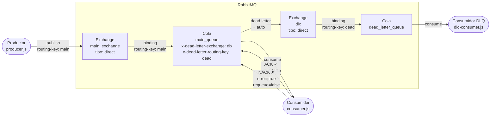

# Patrón Dead Letter Queue (DLQ) con RabbitMQ

> **Ejemplo 3 — TP3: Sistemas Distribuidos y Programación Paralela**

Implementación del patrón **Dead Letter Queue** utilizando RabbitMQ como broker de mensajería y Node.js para los servicios. Los mensajes que el consumidor primario rechaza explícitamente (nack sin reencolar) son enrutados automáticamente por RabbitMQ hacia una cola de mensajes muertos (DLQ), donde un consumidor especializado los recibe y registra.

---

## Arquitectura



### Topología de colas y exchanges

| Recurso             | Tipo   | Atributos clave                                                         |
| ------------------- | ------ | ----------------------------------------------------------------------- |
| `main_exchange`     | direct | durable                                                                 |
| `dlx`               | direct | durable — Dead Letter Exchange                                          |
| `main_queue`        | —      | durable, `x-dead-letter-exchange=dlx`, `x-dead-letter-routing-key=dead` |
| `dead_letter_queue` | —      | durable                                                                 |

---

## Estructura del proyecto

```
patron3-DLQ/
├── producer/
│   ├── producer.js          # Envía 10 mensajes (3 con error:true)
│   ├── package.json
│   └── Dockerfile
├── consumer/
│   ├── consumer.js          # ACK o NACK según campo "error"
│   ├── package.json
│   └── Dockerfile
├── dlq-consumer/
│   ├── dlq-consumer.js      # Imprime mensajes muertos del DLQ
│   ├── package.json
│   └── Dockerfile
├── k8s/
│   ├── rabbitmq-secret.yaml
│   ├── rabbitmq-deployment.yaml
│   ├── producer-deployment.yaml
│   ├── consumer-deployment.yaml
│   └── dlq-consumer-deployment.yaml
├── docker-compose.yml
├── .gitignore
└── README.md
```

---

## Ejecución local con Docker Compose

### Prerrequisitos

- Docker Engine ≥ 20.x
- Docker Compose ≥ 2.x

### Pasos

```bash
# 1. Clonar / ubicarse en el directorio del proyecto
cd hit0/patron3-DLQ

# 2. (Opcional) Crear un archivo .env para personalizar credenciales
#    Si no se crea, se usan los valores por defecto (guest/guest)
cat > .env <<EOF
RABBITMQ_USER=guest
RABBITMQ_PASS=guest
EOF

# 3. Construir imágenes y levantar todos los servicios
docker compose up --build

# 4. Para ejecutar en background y ver logs de un servicio específico
docker compose up --build -d
docker compose logs -f consumer
docker compose logs -f dlq-consumer
docker compose logs -f producer

# 5. Para detener y eliminar contenedores
docker compose down
```

> **Nota:** El servicio `rabbitmq` tiene un healthcheck configurado (`rabbitmq-diagnostics ping`). Los demás servicios esperan a que RabbitMQ esté saludable antes de iniciar (`depends_on: condition: service_healthy`). Además, cada servicio tiene lógica de reintento interno (hasta 10 intentos, cada 3 segundos).

### Acceso a la interfaz de gestión

Una vez levantado el stack, acceder a `http://localhost:15672` con las credenciales configuradas (por defecto `guest` / `guest`).

---

## Despliegue en Kubernetes

### Prerrequisitos

- Cluster de Kubernetes operativo (minikube, k3s, EKS, GKE, etc.)
- `kubectl` configurado apuntando al cluster
- Imágenes de Docker publicadas en un registry accesible por el cluster

### 1. Construir y publicar las imágenes

```bash
# Ajustar MY_REGISTRY con tu registry (ej: docker.io/miusuario)
export MY_REGISTRY=docker.io/miusuario

docker build -t $MY_REGISTRY/dlq-producer:latest ./producer
docker build -t $MY_REGISTRY/dlq-consumer:latest ./consumer
docker build -t $MY_REGISTRY/dlq-dlq-consumer:latest ./dlq-consumer

docker push $MY_REGISTRY/dlq-producer:latest
docker push $MY_REGISTRY/dlq-consumer:latest
docker push $MY_REGISTRY/dlq-dlq-consumer:latest
```

> Actualizar el campo `image:` en los manifiestos de `k8s/` con las rutas publicadas.

### 2. Crear el Secret con las credenciales

**Opción A — desde el manifiesto incluido** (credenciales por defecto `guest/guest`):

```bash
kubectl apply -f k8s/rabbitmq-secret.yaml
```

**Opción B — desde línea de comandos** (recomendado para producción):

```bash
kubectl create secret generic rabbitmq-secret \
  --from-literal=RABBITMQ_USER=<usuario> \
  --from-literal=RABBITMQ_PASS=<contraseña>
```

### 3. Aplicar manifiestos en orden

```bash
# RabbitMQ primero
kubectl apply -f k8s/rabbitmq-deployment.yaml

# Esperar a que el pod de RabbitMQ esté listo
kubectl rollout status deployment/rabbitmq

# Consumidores (antes que el productor)
kubectl apply -f k8s/consumer-deployment.yaml
kubectl apply -f k8s/dlq-consumer-deployment.yaml

# Productor por último
kubectl apply -f k8s/producer-deployment.yaml
```

### 4. Verificar el estado

```bash
# Ver todos los pods
kubectl get pods

# Logs del productor
kubectl logs -l app=producer --follow

# Logs del consumidor primario
kubectl logs -l app=consumer --follow

# Logs del consumidor DLQ
kubectl logs -l app=dlq-consumer --follow
```

### 5. Limpiar recursos

```bash
kubectl delete -f k8s/
```

---

## Comportamiento esperado

### Logs del Productor

```
[2024-...] [Producer] Enviando 10 mensajes...
[2024-...] [Producer] Enviado → id=1  | error=true  | payload="Mensaje de prueba #1"
[2024-...] [Producer] Enviado → id=2  | error=false | payload="Mensaje de prueba #2"
[2024-...] [Producer] Enviado → id=3  | error=true  | payload="Mensaje de prueba #3"
...
[2024-...] [Producer] Enviado → id=10 | error=false | payload="Mensaje de prueba #10"
[2024-...] [Producer] Todos los mensajes enviados. Cerrando conexión.
```

### Logs del Consumidor primario

Los mensajes con `error=false` (ids 2, 4, 6, 7, 8, 9, 10) son **procesados y confirmados (ACK)**:

```
[2024-...] [Consumer] Recibido → id=2  | error=false | payload="Mensaje de prueba #2"
[2024-...] [Consumer] ✓ ACK → id=2 procesado exitosamente.
```

Los mensajes con `error=true` (ids 1, 3, 5) son **rechazados sin reencolar (NACK)**:

```
[2024-...] [Consumer] Recibido → id=1  | error=true  | payload="Mensaje de prueba #1"
[2024-...] [Consumer] ✗ NACK (sin reencolar) → id=1 será enviado al DLQ.
```

### Logs del Consumidor DLQ

Exactamente los 3 mensajes rechazados aparecen en el DLQ:

```
[2024-...] [DLQ] ☠ Mensaje fallido recibido:
  → id:          1
  → payload:     "Mensaje de prueba #1"
  → error:       true
  → sentAt:      2024-...
  → razón DLQ:   rejected
  → cola origen: main_queue
[2024-...] [DLQ] ACK → mensaje id=1 confirmado en DLQ.
```

### Resumen de flujo

| Mensaje ID | `error` | Acción consumidor | Destino final       |
| ---------- | ------- | ----------------- | ------------------- |
| 1          | `true`  | NACK              | `dead_letter_queue` |
| 2          | `false` | ACK               | Procesado           |
| 3          | `true`  | NACK              | `dead_letter_queue` |
| 4          | `false` | ACK               | Procesado           |
| 5          | `true`  | NACK              | `dead_letter_queue` |
| 6–10       | `false` | ACK               | Procesado           |

---

## Decisiones de diseño

### ¿Por qué DLX en lugar de reencolar manualmente?

| Criterio                   | DLX (este enfoque)                        | Reencolar manualmente                          |
| -------------------------- | ----------------------------------------- | ---------------------------------------------- |
| **Complejidad**            | Cero código adicional; RabbitMQ lo maneja | Lógica manual propensa a errores               |
| **Atomicidad**             | El enrutamiento al DLQ es atómico         | Puede perderse el mensaje si el consumidor cae |
| **Bucles infinitos**       | No ocurren; el mensaje va directo al DLQ  | Requiere contador de intentos manual           |
| **Observabilidad**         | Headers `x-death` con metadata automática | Sin metadata adicional                         |
| **Separación de concerns** | Consumidor solo decide ACK/NACK           | Consumidor gestiona también el reencolo        |

### Argumentos de cola utilizados

- **`x-dead-letter-exchange: "dlx"`** — Indica a RabbitMQ a qué exchange enviar los mensajes muertos.
- **`x-dead-letter-routing-key: "dead"`** — Clave de enrutamiento usada al publicar en el DLX. Permite distinguir distintas categorías de mensajes muertos si se tuvieran múltiples DLQs.

### Idempotencia en la declaración de topología

Los tres servicios (producer, consumer, dlq-consumer) declaran la topología completa al iniciar. Las operaciones `assertExchange`, `assertQueue` y `bindQueue` de amqplib son idempotentes: si la cola/exchange ya existe con los mismos parámetros, no falla ni crea duplicados. Esto elimina la necesidad de un servicio separado de inicialización.

### Lógica de reconexión

Cada servicio implementa un bucle de reintentos con hasta 10 intentos separados por 3 segundos antes de abortar. Esto garantiza que incluso si los contenedores de la aplicación arrancan antes de que RabbitMQ esté completamente listo, se reconectan de forma transparente.
